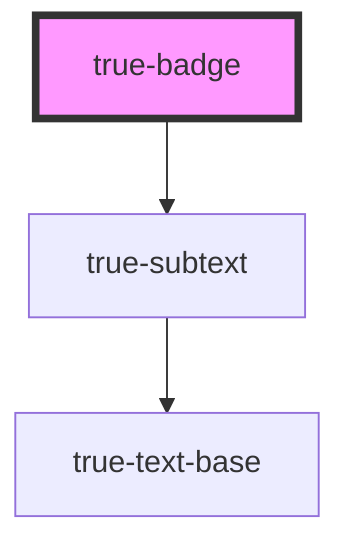

# true-badge

<!-- Auto Generated Below -->

## Properties

| Property | Attribute | Description | Type     | Default     |
| -------- | --------- | ----------- | -------- | ----------- |
| `text`   | `text`    |             | `string` | `''`        |
| `value`  | `value`   |             | `number` | `undefined` |

## Dependencies

### Depends on

- [true-subtext](../../typography/subtext)

### Graph

----------------------------------------------

*Built with [StencilJS](https://stenciljs.com/)*
