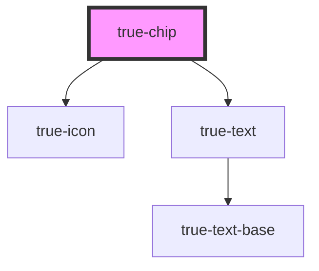

# true-chip

<!-- Auto Generated Below -->

## Properties

| Property    | Attribute    | Description                                  | Type      | Default     |
| ----------- | ------------ | -------------------------------------------- | --------- | ----------- |
| `deletable` | `deletable`  | `true` if the chip can be removed            | `boolean` | `false`     |
| `focused`   | `focused`    | `true` indicates focused state of the chip   | `boolean` | `false`     |
| `hasShadow` | `has-shadow` | `true` if the chip should render box shadow. | `boolean` | `undefined` |

## Events

| Event     | Description                                     | Type               |
| --------- | ----------------------------------------------- | ------------------ |
| `deleted` | Emitted when the user clicks the delete button. | `CustomEvent<any>` |

## Dependencies

### Depends on

- [true-icon](../../icon)
- [true-text](../../typography/text)

### Graph

----------------------------------------------

*Built with [StencilJS](https://stenciljs.com/)*
