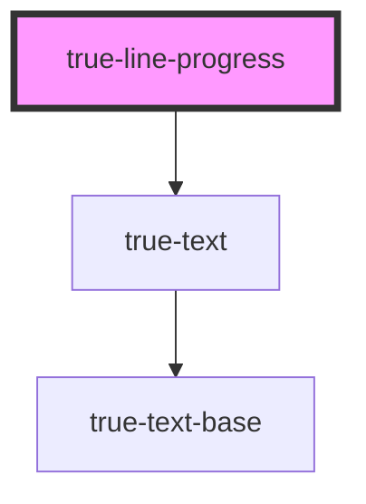

# true-line-progress

<!-- Auto Generated Below -->

## Properties

| Property          | Attribute          | Description                                            | Type                                                                                                                                                                     | Default                 |
| ----------------- | ------------------ | ------------------------------------------------------ | ------------------------------------------------------------------------------------------------------------------------------------------------------------------------ | ----------------------- |
| `backgroundColor` | `background-color` | Color of the track the progress follows                | `"primary" \| "secondary" \| "tertiary"`                                                                                                                                 | `undefined`             |
| `complete`        | `complete`         | Number of complete items                               | `number`                                                                                                                                                                 | `0`                     |
| `progressColor`   | `progress-color`   | Color of the progress line                             | `"custom-brand-accent" \| "destructive" \| "neutral-100" \| "primary" \| "secondary" \| "tertiary" \| "true-primary-blue" \| "true-primary-green" \| "true-primary-red"` | `undefined`             |
| `showFraction`    | `show-fraction`    | `true` if showing the fraction to the right of the bar | `boolean`                                                                                                                                                                | `true`                  |
| `textColor`       | `text-color`       | Color of the inner text                                | `"custom-brand-accent" \| "neutral-100" \| "primary" \| "secondary" \| "tertiary" \| "true-primary-blue" \| "true-primary-green" \| "true-primary-red"`                  | `'custom-brand-accent'` |
| `total`           | `total`            | Number of total items                                  | `number`                                                                                                                                                                 | `1`                     |

## Dependencies

### Depends on

- [true-text](../../typography/text)

### Graph

----------------------------------------------

*Built with [StencilJS](https://stenciljs.com/)*
