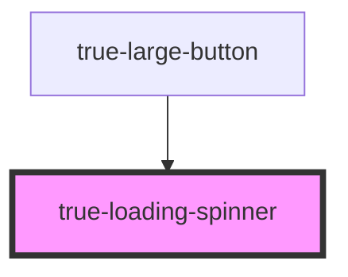

# loop-ui-loading-spinner

<!-- Auto Generated Below -->

## Properties

| Property      | Attribute      | Description                           | Type                                                                                                                                                                        | Default                 |
| ------------- | -------------- | ------------------------------------- | --------------------------------------------------------------------------------------------------------------------------------------------------------------------------- | ----------------------- |
| `loaderColor` | `loader-color` | Color of the loader line              | `"brand-primary-blue" \| "brand-primary-green" \| "brand-primary-red" \| "custom-brand-accent" \| "destructive" \| "neutral-100" \| "primary" \| "secondary" \| "tertiary"` | `'custom-brand-accent'` |
| `pathColor`   | `path-color`   | Color of the track the loader follows | `"primary" \| "secondary" \| "tertiary"`                                                                                                                                    | `'tertiary'`            |
| `size`        | `size`         |                                       | `"l" \| "m" \| "s" \| "xl"`                                                                                                                                                 | `'m'`                   |

## Dependencies

### Used by

 - [true-large-button](../../buttons/large-button)

### Graph

----------------------------------------------

*Built with [StencilJS](https://stenciljs.com/)*
