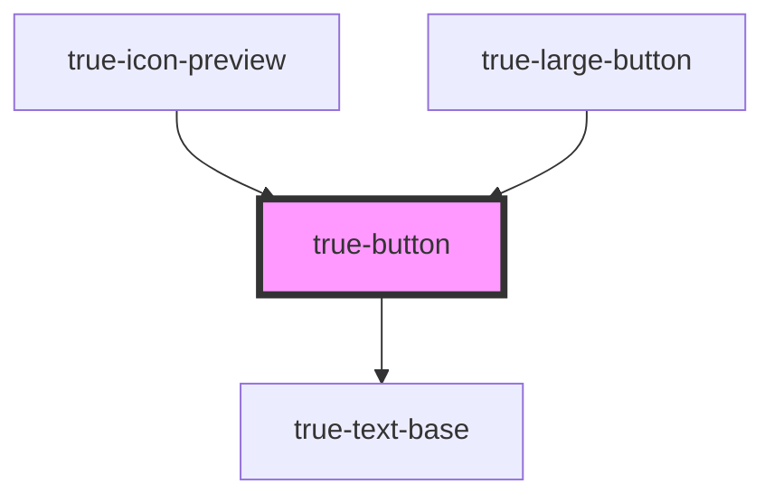

# true-button

<!-- Auto Generated Below -->

## Properties

| Property     | Attribute     | Description                                                         | Type                                   | Default     |
| ------------ | ------------- | ------------------------------------------------------------------- | -------------------------------------- | ----------- |
| `disabled`   | `disabled`    | `true` if the button is disabled and cannot be interacted with      | `boolean`                              | `false`     |
| `hasOverlay` | `has-overlay` | `true` if the overlay should be rendered over the button            | `boolean`                              | `undefined` |
| `submit`     | `submit`      | Whether or not to render the button as a submit button              | `boolean`                              | `false`     |
| `textAlign`  | `text-align`  | How the button text should be aligned                               | `"center" \| "left"`                   | `'center'`  |
| `textSize`   | `text-size`   | the size of the text to use in the button                           | `"m" \| "s"`                           | `'s'`       |
| `theme`      | `theme`       | The theme determines which platform styles to use.                  | `"light" \| "dark"`                    | `undefined` |
| `type`       | `type`        | The intended action of the button (primary, secondary, destructive) | `"danger" \| "primary" \| "secondary"` | `'primary'` |

## Slots

| Slot | Description                            |
| ---- | -------------------------------------- |
|      | Content is placed in the default slot. |

## Dependencies

### Used by

 - [true-icon-preview](../../icon/icon-preview)
 - [true-large-button](../large-button)

### Depends on

- [true-text-base](../../typography/text-base)

### Graph

----------------------------------------------

*Built with [StencilJS](https://stenciljs.com/)*
