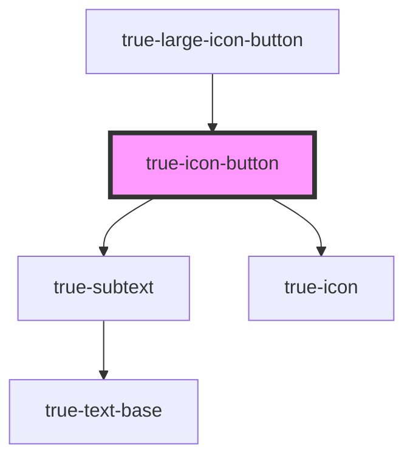

# true-icon-button

<!-- Auto Generated Below -->

## Properties

| Property     | Attribute     | Description                                                        | Type                                   | Default       |
| ------------ | ------------- | ------------------------------------------------------------------ | -------------------------------------- | ------------- |
| `badge`      | `badge`       | Number shown in a badge in the corner of the button                | `number`                               | `undefined`   |
| `disabled`   | `disabled`    | `true` if the button is disabled and cannot be interacted with.    | `boolean`                              | `false`       |
| `flip`       | `flip`        | Flips the icon horizontally (h) of vertically (v) in css           | `"h" \| "v"`                           | `undefined`   |
| `hasOverlay` | `has-overlay` | `true` if the overlay should be rendered.                          | `boolean`                              | `undefined`   |
| `icon`       | `icon`        | The icon to display inside the button                              | `string`                               | `undefined`   |
| `shadow`     | `shadow`      | `true` if a box shadow should be shown (only suports primary type) | `boolean`                              | `false`       |
| `size`       | `size`        | Size of the icon                                                   | `"l" \| "m" \| "s" \| "xl" \| "xs"`    | `'m'`         |
| `tabindex`   | `tabindex`    | The keyboard focus order                                           | `number`                               | `0`           |
| `toggled`    | `toggled`     | `true` if button is in toggled state                               | `boolean`                              | `false`       |
| `type`       | `type`        | The color display of the button.                                   | `"danger" \| "primary" \| "secondary"` | `'secondary'` |

## Dependencies

### Used by

 - [true-large-icon-button](../large-icon-button)

### Depends on

- [true-subtext](../../typography/subtext)
- [true-icon](../../icon)

### Graph

----------------------------------------------

*Built with [StencilJS](https://stenciljs.com/)*
