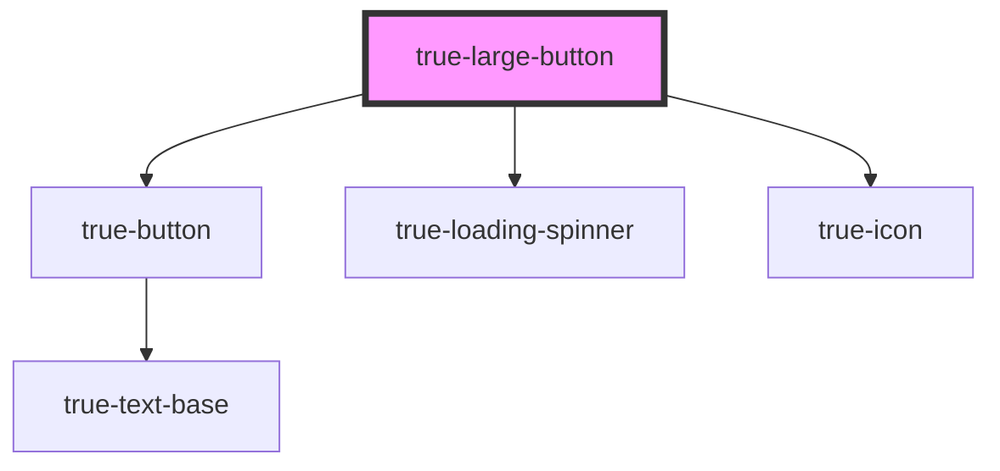

# true-large-button

<!-- Auto Generated Below -->

## Properties

| Property    | Attribute    | Description                                                              | Type                                   | Default     |
| ----------- | ------------ | ------------------------------------------------------------------------ | -------------------------------------- | ----------- |
| `busy`      | `busy`       | `true` if the button is in a busy state.                                 | `boolean`                              | `false`     |
| `disabled`  | `disabled`   | `true` if the button is disabled and cannot be interacted with.          | `boolean`                              | `false`     |
| `icon`      | `icon`       | The icon to display on the right side of the button                      | `string`                               | `undefined` |
| `submit`    | `submit`     | Whether or not to render the button as a submit button                   | `boolean`                              | `false`     |
| `textAlign` | `text-align` | Whether to align the text left or center. Center is default              | `"center" \| "left"`                   | `'center'`  |
| `type`      | `type`       | The importance of action the button is intended for (primary, secondary) | `"danger" \| "primary" \| "secondary"` | `'primary'` |

## Slots

| Slot | Description                            |
| ---- | -------------------------------------- |
|      | Content is placed in the default slot. |

## Dependencies

### Depends on

- [true-button](../button)
- [true-loading-spinner](../../basic-app/loading-spinner)
- [true-icon](../../icon)

### Graph

----------------------------------------------

*Built with [StencilJS](https://stenciljs.com/)*
