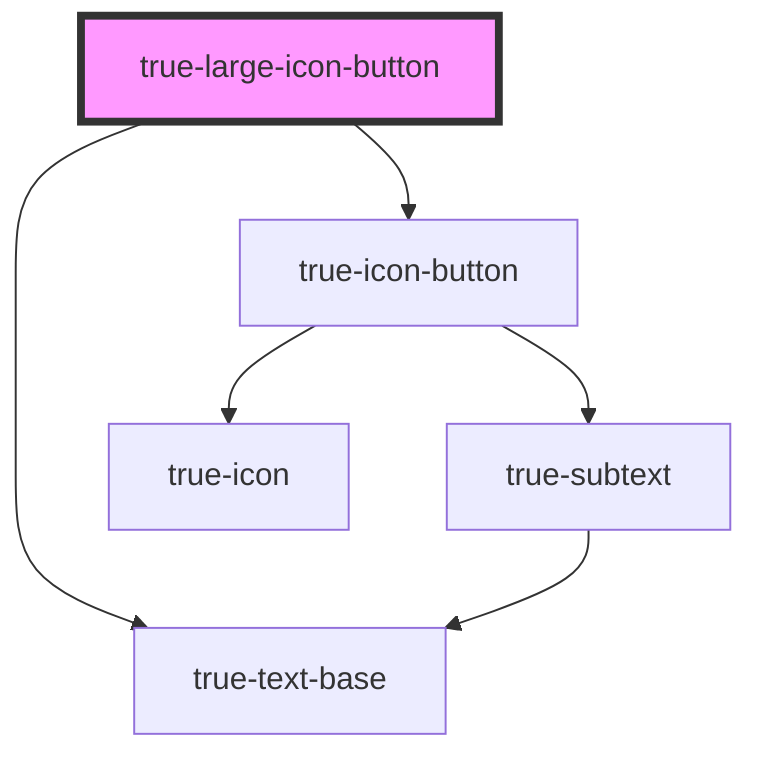

# true-large-icon-button

<!-- Auto Generated Below -->

## Properties

| Property   | Attribute  | Description                                                     | Type                                   | Default       |
| ---------- | ---------- | --------------------------------------------------------------- | -------------------------------------- | ------------- |
| `disabled` | `disabled` | `true` if the button is disabled and cannot be interacted with. | `boolean`                              | `false`       |
| `icon`     | `icon`     | The icon to display inside the button                           | `string`                               | `undefined`   |
| `type`     | `type`     | The color display of the button.                                | `"danger" \| "primary" \| "secondary"` | `'secondary'` |

## Dependencies

### Depends on

- [true-icon-button](../icon-button)
- [true-text-base](../../typography/text-base)

### Graph

----------------------------------------------

*Built with [StencilJS](https://stenciljs.com/)*
