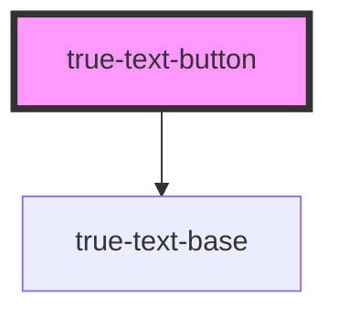

# true-text-button

<!-- Auto Generated Below -->

## Properties

| Property    | Attribute   | Description                                                                      | Type                                              | Default     |
| ----------- | ----------- | -------------------------------------------------------------------------------- | ------------------------------------------------- | ----------- |
| `disabled`  | `disabled`  | `true` if the button is disabled and cannot be interacted with.                  | `boolean`                                         | `false`     |
| `focusable` | `focusable` | If true allow element to be focusable                                            | `boolean`                                         | `true`      |
| `location`  | `location`  | A link href. If provided the button will render as a link using an a tag         | `string`                                          | `undefined` |
| `newTab`    | `new-tab`   | If a location is provided, add this attribute to have the link open in a new tab | `boolean`                                         | `undefined` |
| `size`      | `size`      | The size of the text button, defaults small.                                     | `"l" \| "m" \| "s" \| "xl"`                       | `'s'`       |
| `theme`     | `theme`     | The theme determines which platform styles to use.                               | `"light" \| "dark"`                               | `undefined` |
| `type`      | `type`      | The color display of the button.                                                 | `"danger" \| "primary" \| "secondary"`            | `'primary'` |
| `weight`    | `weight`    | The weight of the text in the button.                                            | `"bold" \| "extra-bold" \| "medium" \| "regular"` | `'medium'`  |

## Slots

| Slot | Description                            |
| ---- | -------------------------------------- |
|      | Content is placed in the default slot. |

## Dependencies

### Depends on

- [true-text-base](../../typography/text-base)

### Graph

----------------------------------------------

*Built with [StencilJS](https://stenciljs.com/)*
