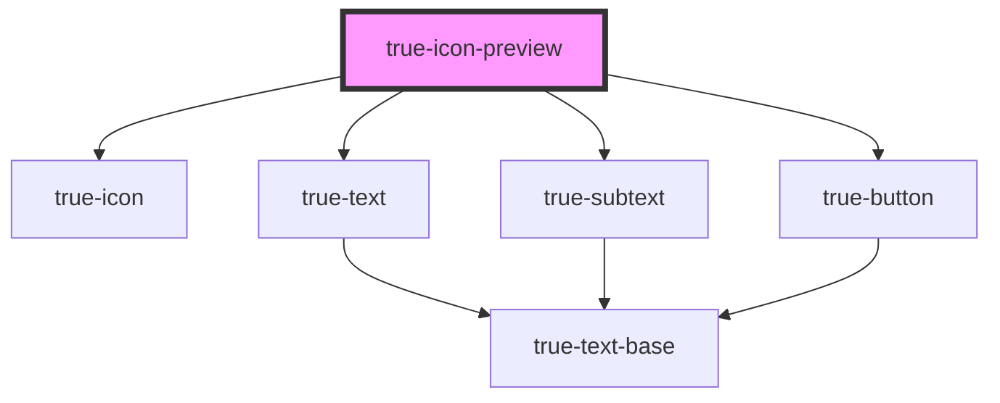

# true-icon-preview

<!-- Auto Generated Below -->

## Properties

| Property | Attribute | Description | Type     | Default     |
| -------- | --------- | ----------- | -------- | ----------- |
| `icons`  | `icons`   |             | `string` | `undefined` |

## Dependencies

### Depends on

- [true-icon](..)
- [true-text](../../typography/text)
- [true-subtext](../../typography/subtext)
- [true-button](../../buttons/button)

### Graph

----------------------------------------------

*Built with [StencilJS](https://stenciljs.com/)*
