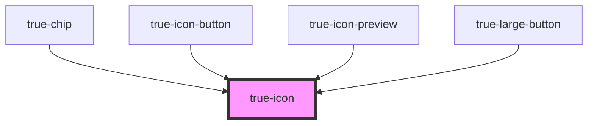

# true-icon

<!-- Auto Generated Below -->

## Properties

| Property       | Attribute       | Description                                                                                     | Type                                                                                                                                                                     | Default     |
| -------------- | --------------- | ----------------------------------------------------------------------------------------------- | ------------------------------------------------------------------------------------------------------------------------------------------------------------------------ | ----------- |
| `color`        | `color`         |                                                                                                 | `"custom-brand-accent" \| "destructive" \| "neutral-100" \| "primary" \| "secondary" \| "tertiary" \| "true-primary-blue" \| "true-primary-green" \| "true-primary-red"` | `undefined` |
| `defaultLabel` | `default-label` | Specifies the label to use for accessibility. Defaults to the icon name.                        | `string`                                                                                                                                                                 | `undefined` |
| `lazy`         | `lazy`          | If enabled, ion-icon will be loaded lazily when it's visible in the viewport. Default, `false`. | `boolean`                                                                                                                                                                | `false`     |
| `name`         | `name`          | Specifies which icon to use from the built-in set of icons.                                     | `string`                                                                                                                                                                 | `undefined` |
| `size`         | `size`          | The size of the icon: xxs through xl                                                            | `"l" \| "m" \| "s" \| "xl" \| "xs" \| "xxs"`                                                                                                                             | `undefined` |

## Dependencies

### Used by

 - [true-chip](../basic-app/chip)
 - [true-icon-button](../buttons/icon-button)
 - [true-icon-preview](icon-preview)
 - [true-large-button](../buttons/large-button)

### Graph

----------------------------------------------

*Built with [StencilJS](https://stenciljs.com/)*
