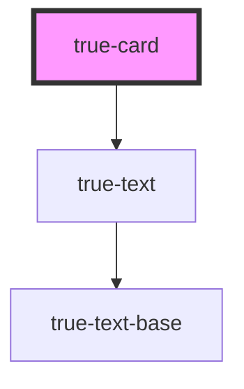

# true-card

<!-- Auto Generated Below -->

## Properties

| Property    | Attribute    | Description                            | Type      | Default     |
| ----------- | ------------ | -------------------------------------- | --------- | ----------- |
| `header`    | `header`     | Text in the header of the card         | `string`  | `undefined` |
| `noHeader`  | `no-header`  | If true do not render card header text | `boolean` | `undefined` |
| `noPadding` | `no-padding` | Sets padding of card to 0              | `boolean` | `undefined` |

## Dependencies

### Depends on

- [true-text](../../typography/text)

### Graph

----------------------------------------------

*Built with [StencilJS](https://stenciljs.com/)*
