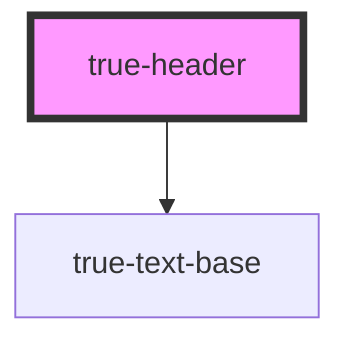

# true-header

<!-- Auto Generated Below -->

## Properties

| Property   | Attribute   | Description                                                                                                             | Type                                                                                                                                                    | Default     |
| ---------- | ----------- | ----------------------------------------------------------------------------------------------------------------------- | ------------------------------------------------------------------------------------------------------------------------------------------------------- | ----------- |
| `color`    | `color`     | Passthrough prop for the color of the header                                                                            | `"custom-brand-accent" \| "neutral-100" \| "primary" \| "secondary" \| "tertiary" \| "true-primary-blue" \| "true-primary-green" \| "true-primary-red"` | `undefined` |
| `maxLines` | `max-lines` | The maximum lines to display before truncating the header. Default behavior shows all lines of text with no truncation. | `string`                                                                                                                                                | `undefined` |
| `size`     | `size`      | The size of the header                                                                                                  | `"h1" \| "h2" \| "h3" \| "h4"`                                                                                                                          | `'h1'`      |
| `weight`   | `weight`    | Passthrough prop for weight of the header                                                                               | `"bold" \| "extra-bold" \| "medium" \| "regular"`                                                                                                       | `'medium'`  |

## Dependencies

### Depends on

- [true-text-base](../text-base)

### Graph

----------------------------------------------

*Built with [StencilJS](https://stenciljs.com/)*
