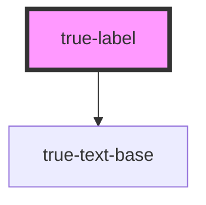

# true-label

<!-- Auto Generated Below -->

## Properties

| Property   | Attribute   | Description                                                                                                             | Type                                                                                                                                                    | Default     |
| ---------- | ----------- | ----------------------------------------------------------------------------------------------------------------------- | ------------------------------------------------------------------------------------------------------------------------------------------------------- | ----------- |
| `color`    | `color`     | Passthrough prop for the color of the label                                                                             | `"custom-brand-accent" \| "neutral-100" \| "primary" \| "secondary" \| "tertiary" \| "true-primary-blue" \| "true-primary-green" \| "true-primary-red"` | `undefined` |
| `maxLines` | `max-lines` | The maximum lines to display before truncating the label. Default behavior shows all lines of label with no truncation. | `string`                                                                                                                                                | `undefined` |

## Dependencies

### Depends on

- [true-text-base](../text-base)

### Graph

----------------------------------------------

*Built with [StencilJS](https://stenciljs.com/)*
