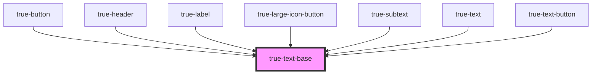

# true-text-base

<!-- Auto Generated Below -->

## Properties

| Property   | Attribute   | Description                                                                                  | Type                                                                                                                                                    | Default     |
| ---------- | ----------- | -------------------------------------------------------------------------------------------- | ------------------------------------------------------------------------------------------------------------------------------------------------------- | ----------- |
| `color`    | `color`     | Primary color of the text Uses predefined css variables                                      | `"custom-brand-accent" \| "neutral-100" \| "primary" \| "secondary" \| "tertiary" \| "true-primary-blue" \| "true-primary-green" \| "true-primary-red"` | `undefined` |
| `maxLines` | `max-lines` | Maximum lines to display before truncating the text If no value is given all lines will show | `string`                                                                                                                                                | `undefined` |
| `size`     | `size`      | Size of the text                                                                             | `"l" \| "m" \| "s" \| "xl" \| "xs" \| "xxl" \| "xxs" \| "xxxl"`                                                                                         | `'m'`       |
| `weight`   | `weight`    | Weight of the text                                                                           | `"bold" \| "extra-bold" \| "medium" \| "regular"`                                                                                                       | `undefined` |

## Dependencies

### Used by

 - [true-button](../../buttons/button)
 - [true-header](../header)
 - [true-label](../label)
 - [true-large-icon-button](../../buttons/large-icon-button)
 - [true-subtext](../subtext)
 - [true-text](../text)
 - [true-text-button](../../buttons/text-button)

### Graph

----------------------------------------------

*Built with [StencilJS](https://stenciljs.com/)*
